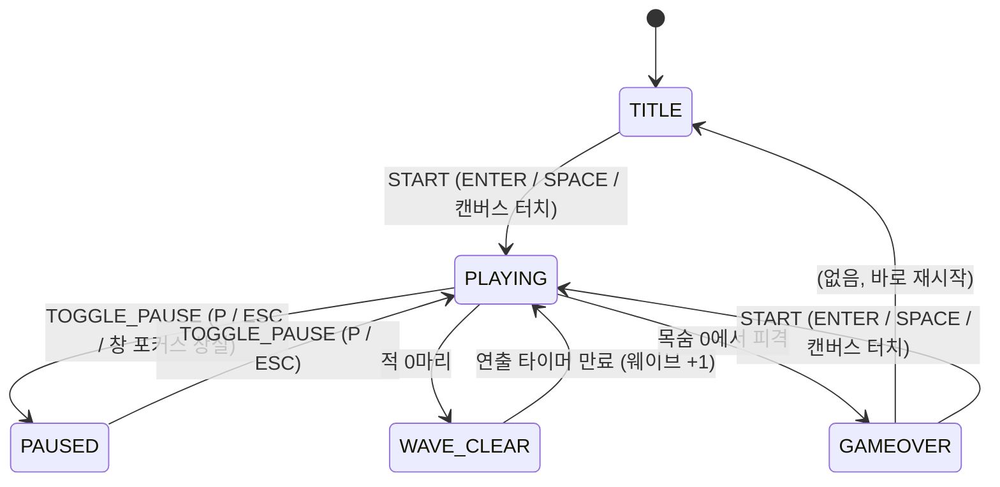
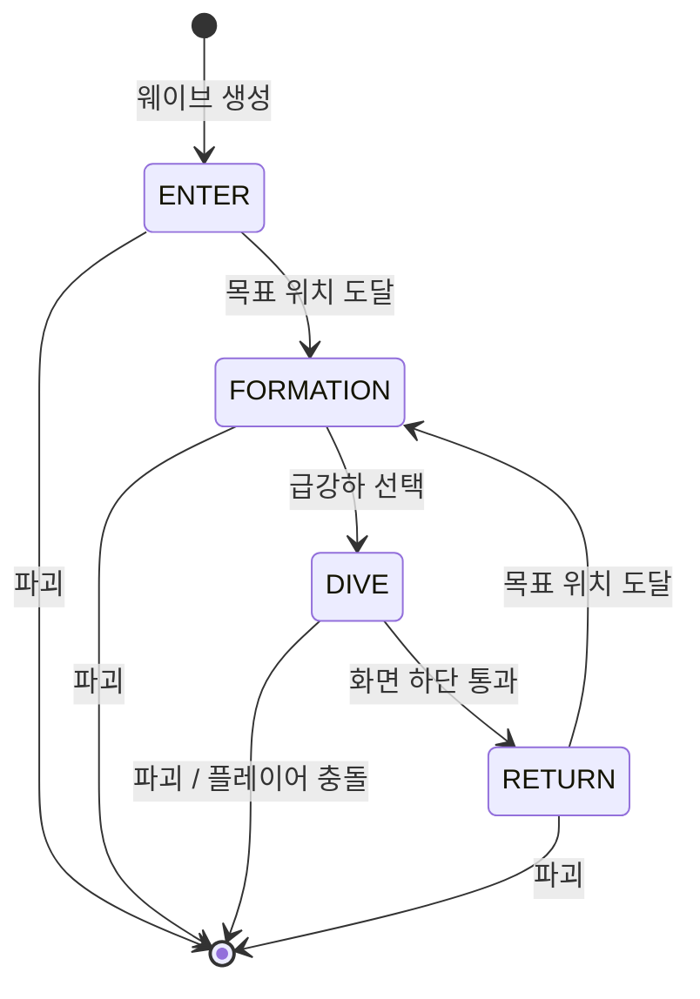

# 상태 기계 정의

## 1. 게임 화면 상태

### 전이 표

| 현재 상태  | 이벤트       | 조건                       | 다음 상태  | 부수 효과                              |
| ---------- | ------------ | -------------------------- | ---------- | -------------------------------------- |
| TITLE      | START        | -                          | PLAYING    | 점수·목숨·웨이브 초기화, 웨이브 1 생성 |
| PLAYING    | TOGGLE_PAUSE | -                          | PAUSED     | 입력 상태 초기화                       |
| PLAYING    | BLUR         | -                          | PAUSED     | 입력 상태 초기화                       |
| PAUSED     | TOGGLE_PAUSE | -                          | PLAYING    | -                                      |
| PLAYING    | TICK         | 적 수 == 0                 | WAVE_CLEAR | 클리어 효과음, 연출 타이머 시작        |
| WAVE_CLEAR | TICK         | 타이머 <= 0                | PLAYING    | 웨이브 +1, 탄 제거, 새 대형 생성       |
| PLAYING    | TICK         | 플레이어 피격 && 목숨 == 0 | GAMEOVER   | 최고 점수 갱신                         |
| GAMEOVER   | START        | -                          | PLAYING    | TITLE→PLAYING과 동일                   |

규칙:

- 전이는 `Game.dispatch(event)`와 `Game.update(dt)` 두 곳에서만 일어난다. 렌더러·입력 모듈은 상태를 직접 바꾸지 않는다.
- `update(dt)`는 PLAYING과 WAVE_CLEAR에서만 게임 로직을 진행한다. 배경 별과 파티클은 모든 상태에서 진행한다(TITLE·PAUSED·GAMEOVER에서는 감속).
- START 이벤트는 TITLE, GAMEOVER에서만 유효하다. 다른 상태에서는 무시한다.

## 2. 적 상태

| 상태      | 이동 규칙                                                  | 사격                         |
| --------- | ---------------------------------------------------------- | ---------------------------- |
| ENTER     | 진입 지연 후 목표 위치를 향해 곡선 이동                    | 없음                         |
| FORMATION | 대형 위치 + 대형 흔들림 오프셋                             | 낮은 확률 직선탄             |
| DIVE      | 3차 베지어 곡선(시작 → 옆으로 → 플레이어 근처 → 화면 아래) | 플레이어 조준탄, 쿨다운 있음 |
| RETURN    | 화면 상단에서 목표 위치를 향해 직선 이동                   | 없음                         |

급강하 선택은 FORMATION 상태의 적 중에서만 이루어지며, 플레이어가 사망 상태이면 새 급강하를 시작하지 않는다.

## 3. 플레이어 상태

| 상태  | 설명                                      | 전이                                        |
| ----- | ----------------------------------------- | ------------------------------------------- |
| ALIVE | 조작 가능. `invincible > 0`이면 피격 무시 | 피격 → DEAD                                 |
| DEAD  | 조작 불가, 재출현 타이머 진행             | 타이머 만료 && 목숨 >= 0 → ALIVE(무적 시작) |
